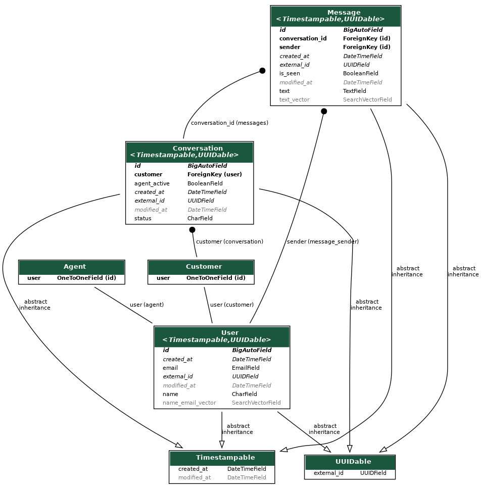

# Branch International Assignment - Chat Application

<p align="center">
  
</p>

Hello Everyone at Branch, This is my chat application. Let me walk you through the assignment what all I implemented and my design choices.

## Flow and how to run the project

- `/support/customer/`  For the customer flow
- `/support/agent/`  For the agent flow

Login Credentials for Admin Panel available on `/admin/`:
- Username: admin
- Password: admin

## Setup
### Docker Setup
If you have docker installed you can simply just do the following.

```CMD
docker-compose up --build -d
```

### To Create Local Setup
1. Clone the repository:

```CMD
git clone https://github.com/GeekGawd/branch-assignment
```
To run the server, you need to have Python installed on your machine. If you don't have it installed, you can follow the instructions [here](https://www.python.org/downloads/release/python-3117/) to install it.

2. Install & Create a virtual environment:

```CMD
pip install virtualenv
virtualenv venv
```

3. Activate the virtual environment:
```CMD
./venv/scripts/activate
# For Ubuntu
source venv/bin/activate
```

4. Install the dependencies: 

```CMD
pip install -r requirements.txt
```
5. Setup postgreSQL
- Install postgreSQL on your local machine by searching on google
- Create a table branch

6. Setup ENV
You need to create a .env file with the following key/value, change it according to your needs
```
SECRET_KEY=django-insecure-t1xmw&dqyhc+_&b@x86!kt7o1@p+0_v%g2t5@b3+pz9_#t)7fq
CHANNEL_HOST=localhost
REDIS_URL=redis://localhost:6379/0
POSTGRES_DB_NAME=branch
POSTGRES_DB_USER=postgres
POSTGRES_DB_PASSWORD=admin
POSTGRES_DB_HOST=localhost
POSTGRES_DB_PORT=5432
```

7. Make the database table and add migration
```CMD
python manage.py makemigrations
python manage.py migrate
```

8. Run the server
```CMD
python manage.py runserver
```

## Features and Design Choices

- Websockets: I implemented websockets because we wanted persistent connections for chats, and this is one of the ways we can achieve it in real time.

- PostgreSQL: Its a solid SQL database, provides great Read performance, I also implemented Full Text Search and Faceted Search with the help of search vector available in PostgreSQL.

- Django: Extremely fast to develop with and very similar to Ruby on Rails (which I believe branch uses in the backend).

Also, implemented the following bonus features:

- ✅ No two agents can work on the same support request and they cannot also forcefully enter a conversation, the connection will be closed if a agent tries to enter forcefully through url.

- ✅ Implemented Faceted Search to better priotise and focus on support requests that matter.

- ✅ Implemented Search Functionality on user, username and messages. Also, implemented GIN index for fast retrieval and search.

- ✅ Implemented preconfigured canned messages that changes as conversation goes on.

- ✅ Made UI using Django MVT architecture.

## Database Design and Scalability

<p align="center">
  
</p>

- Implemented AutoIncrement ID as primary key and UUID as external_id to reference other models objects. This is done for the following reasons:
  - To easily index the AutoIncrement field and database is also easier to maintain.
  - There is security threats and issues if the simple auto increment id is exposed to users.
  - The UUID is hard to index but can't be predicted so it is passed in urls and json to reference other table and objects.

- There is conversation table that stores which customer the support request (aka Conversation) belongs to, it has fields like agent_active (that helps to know if it is being worked upon).

To make scale this application in the future.

- We can vertically scale the application at first. Like increasing redis memory and increasing number of redis nodes for websockets.

- Database: As the database size increases:
  - Sharding: We can shard the database, to accomodate more messages in future.
  - Partition: We can partition the database on the basis on timestamps per month.
  - Move to more performant databases like ScyllaDB which is used by big companies like Discord to really scale.

- Kubernetes to maintain clusters of Django Application, to scale horizontally.
